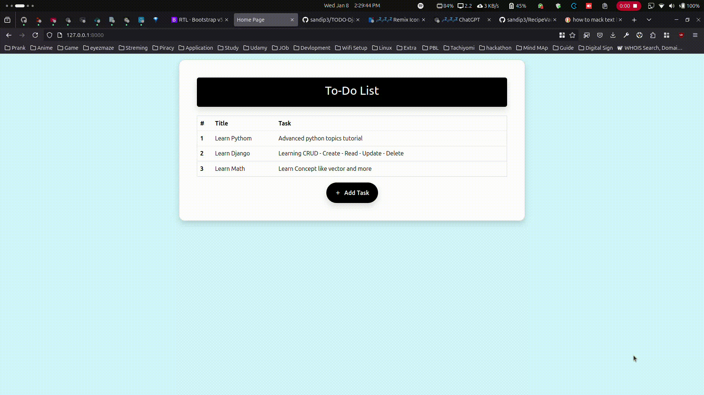
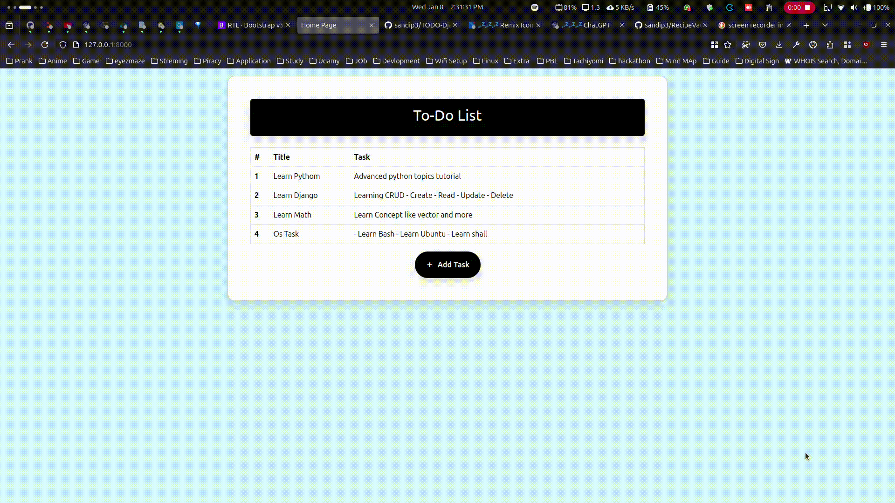

# **To-Do List App**

---

## **Screenshots**

1. **Home Page**:  
   

2. **Add Page**:  
   

3. **Update Page**:  
   

---

## **Videos**

1. **Add Function**:  
   

2. **Update Function**:  
   

3. **Delete Function**:  
   

---
## **Overview**
- The **To-Do List App** is a simple task management application built with:
  - **Django** for backend development.
  - **HTML**, **CSS**, and **Bootstrap** for frontend design.
- Key functionalities include adding, viewing, updating, and deleting tasks.
- Features a responsive design optimized for both desktop and mobile devices.

---

## **Technologies Used**
- **Frontend**:
  - **HTML**: For structuring content.
  - **CSS**: For designing and styling.
  - **Bootstrap**: For creating responsive, mobile-friendly interfaces.

- **Backend**:
  - **Django**: To manage server-side logic and database operations.

- **Database**:
  - **SQLite**: A lightweight, serverless database for managing tasks.

---

## **Key Features**
1. **Add Tasks**:
   - Users can add new tasks with descriptions and deadlines.

2. **View Tasks**:
   - View a list of all tasks with their details.

3. **Update Tasks**:
   - Edit task details dynamically.

4. **Delete Tasks**:
   - Remove tasks directly from the user interface.

5. **Responsive Design**:
   - Optimized for mobile and desktop users.

---

## **Development Highlights**
1. **Database Management**:
   - Encountered and resolved errors related to the database configuration.

2. **Dynamic Links**:
   - Worked on improving dynamic link functionality, resolving challenges with link generation and routing.

3. **Error Handling**:
   - Identified and fixed issues during development, particularly related to dynamic links and database operations.

---

## **Installation**

1. **Clone the repository**:
   ```bash
   git clone https://github.com/sandip3/TODO-Django-.git
   ```

2. **Navigate to the project directory**:
   ```bash
   cd todo-list
   ```

3. **Install dependencies**:
   - Install the required Python packages:
   ```bash
   pip install -r requirements.txt
   ```

4. **Apply migrations**:
   - Set up the database:
   ```bash
   python manage.py migrate
   ```

5. **Run the development server**:
   ```bash
   python manage.py runserver
   ```

6. **Access the app**:
   - Open your browser and go to:
   ```url
   http://127.0.0.1:8000/
   ```

---

## **Reflection**
- **Challenges**:
  - Faced issues with dynamic link generation and routing.
  - Encountered database errors that required debugging.

- **Takeaways**:
  - Strengthened problem-solving skills by working independently on errors.
  - Gained a deeper understanding of database and dynamic link handling.

---

## **Final Project Link**
- [To-Do List GitHub Repository](https://github.com/sandip3/TODO-Django-)

---

## **Connect with Me**
- **LinkedIn**: [Sandip Mishra](https://www.linkedin.com/in/sandip-mishra333/)  
- **GitHub**: [My GitHub Profile](https://github.com/sandip3/)

---
